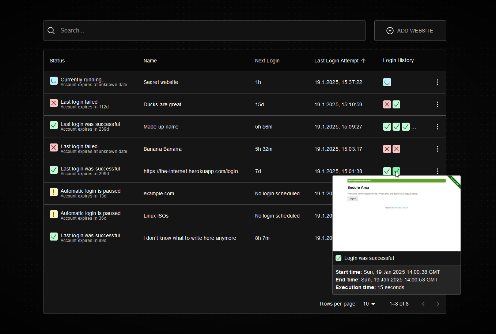

# Enterr
Some websites delete your account after a period of inactivity. This tool helps manage your logins by automatically logging into your accounts, ensuring they remain active.

> [!WARNING]
> This tool is still at an early stage of development. Expect breaking changes.

> [!CAUTION]
> Disclaimer: **Use of this tool may violate the Terms of Service (TOS) of the websites it interacts with.** Users are solely responsible for any consequences. The developers are not liable for misuse or damages.



## Docker compose
Create a `docker-compose.yml` and add the following. You can change the port if you want.
```yml
services:
  enterr:
    container_name: enterr
    image: ghcr.io/jonbunator/enterr:latest
    volumes:
      - ./config:/config
    ports:
      - "8080:8080"
    restart: unless-stopped
```
Then start the container:
```bash
docker compose up -d
```